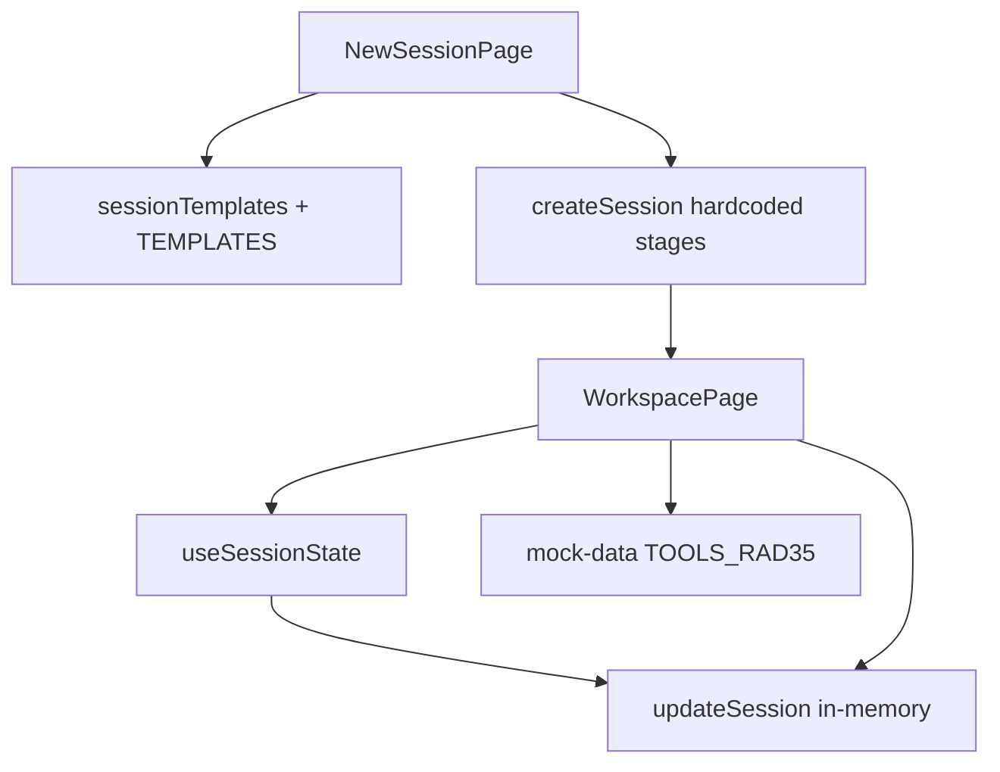
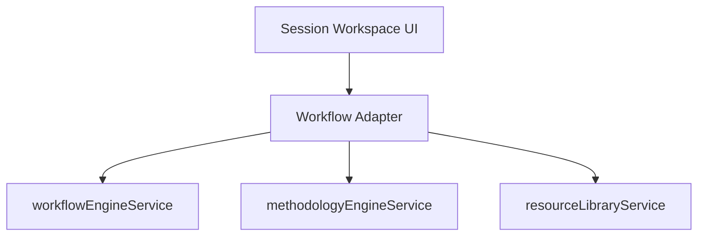
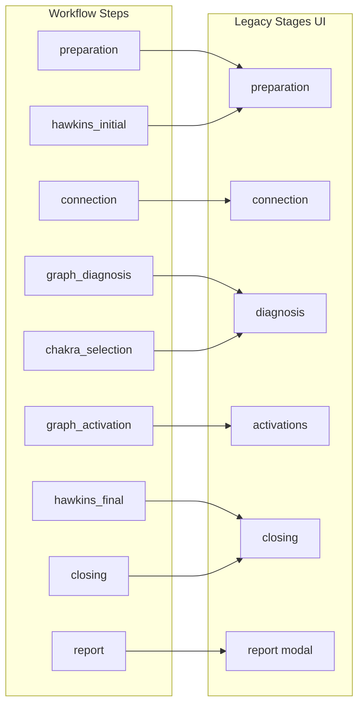
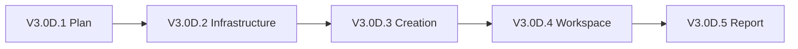

# RADIONICS — Workflow Adapter V3.0D.1 Plan

**Status:** Planning only — no implementation  
**Date:** 2026  
**Depends on:** V3.0A.1 plan, V3.0B schema, V3.0C read service  
**First adapter target:** Mesa 35 (`mesa-35`)

---

## Objetivo

Introduzir uma camada **Workflow Adapter** entre o Session Workspace existente e o `workflowEngineService`, permitindo que Mesa 35 consuma workflows dinâmicos **sem reescrever** a UI do workspace.

> O workspace não deve saber se os dados vieram de `TEMPLATES` mock ou de `workflow_templates`.

---

## 1. Current Workspace Audit

### 1.1 Criação de sessões

| Aspeto | Implementação actual | Ficheiro |
|--------|---------------------|----------|
| Entrada | Wizard 4 passos: especialidade → template → cliente → confirmar | `src/pages/sessions/NewSessionPage.tsx` |
| Templates | `getActiveTemplatesForSpecialty()` filtra `TEMPLATES` em `mock-data.ts` | `src/lib/sessionTemplates.ts` |
| Criação | `createSession()` valida cliente + template; ignora estrutura do template para stages | `src/services/sessionsService.ts` |
| Stages iniciais | **Hardcoded** — sempre 5: `preparation`, `connection`, `diagnosis`, `activations`, `closing` | `sessionsService.ts` L90–96 |
| Metodologia | `resolveSpecialtyToMethodologyId()` → `meth-rad35` para `mesa-35` | `sessionTemplates.ts` |
| Estado inicial | `toolResults: []`, `fieldValues: {}`, `status: 'draft'` | `sessionsService.ts` |

O template seleccionado (`tmpl-rad35-official`, `tmpl-rad35-express`, etc.) influencia apenas `templateId` / `templateName` — **não** define passos executáveis no workspace.

### 1.2 Selecção de templates

```
Nova sessão
  → getApprovedSpecialties()
  → getActiveTemplatesForSpecialty(specialty)   // TEMPLATES mock
  → createSession({ templateId, specialtySlug, … })
```

Associação specialty → template via `specialtyIds`, `specialtySlugs` ou `methodologyId` legado (`meth-rad35`).

**Workflow Engine (V3.0C):** `hasWorkflowForSpecialty()` e `getDefaultWorkflowForSpecialty()` existem mas **não estão ligados** ao wizard.

### 1.3 Armazenamento de stages

| Campo | Uso |
|-------|-----|
| `session.stages[]` | `SessionStage` com `code`, `label`, `status`, `steps[]` — populado na criação, **subutilizado** na UI |
| `session.currentStageCode` | Persistido no save; hidrata `currentStage` local no workspace |
| UI `currentStage` | Estado React local; navegação por 5 códigos fixos |

O workspace renderiza com fallback hardcoded se `session.stages` estiver vazio (`WorkspacePage.tsx` L1671–1677).

### 1.4 toolResults

| Local | Detalhe |
|-------|---------|
| `session.toolResults` | Fonte principal em runtime (top-level) |
| `session.stages[].steps[].toolResults` | Legado em seeds; fundido por `normalizeSessionWorkspace()` |
| `ToolResult` | `toolId`, `toolName`, `status` (`not_analyzed` → `identified` → `activated`), notas, voice notes |
| Patch | `applyToolResultPatch()` usa `getToolsByMethodology(methodologyId)` para metadata | `src/lib/sessionWorkspace.ts` |

**Gap crítico Mesa 35:** `getToolsByMethodology('meth-rad35')` devolve `TOOLS_RAD35` — **apenas 8 gráficos** (`mock-data.ts` L336–345), não os 35 do Methodology Engine.

### 1.5 fieldValues

- `Record<string, FieldValue>` na sessão.
- Gerido por `useSessionState` (`setFieldValue` / `getFieldValue`).
- Template blocks definem `fieldCode` (ex.: `intention`, `hawkins_initial`) mas o workspace **não renderiza** blocks do template dinamicamente — campos são parcialmente duplicados na UI (ex.: `session.intention` no wizard).

### 1.6 Navegação entre stages

```
StageSidebar + breadcrumb (5 botões fixos)
  → selectStage(code)
  → persistWorkspace({ currentStageCode })
  → switch render: currentStage === 'preparation' | 'connection' | …
```

Componentes de stage definidos **inline** em `WorkspacePage.tsx`:

| Stage legado | Componente | Dados |
|--------------|------------|-------|
| `preparation` | `PreparationStage` | Intenção + **Hawkins inicial** |
| `connection` | `ConnectionStage` | Respiração guiada (mock UI) |
| `diagnosis` | `DiagnosisStage` | Grid de gráficos via `getToolsByMethodology` |
| `activations` | `ActivationsStage` | Ativação de gráficos identificados |
| `closing` | `ClosingStage` | **Hawkins final** + reverberação + link relatório |

Não existe stage `report` na navegação — relatório abre via modal (`ReportPreviewModal`).

### 1.7 Conclusão de stages

`computeStageCompletion()` (`session-state.ts`):

| Stage | Regra actual |
|-------|--------------|
| `preparation` | `hawkinsInitial !== null` |
| `connection` | sempre `true` |
| `diagnosis` | todos os tools da metodologia analisados/skipped |
| `activations` | todos os identificados activados/skipped |
| `closing` | `hawkinsFinal` + `reverbDays` definidos |

Regras acopladas a `methodologyId` + lista fixa de tools mock.

### 1.8 Relatórios

| Caminho | Fonte de dados |
|---------|----------------|
| Modal no workspace | `useSessionState().sessionSnapshot` |
| `buildSnapshotFromState()` | `hawkins_*`, `tool_results`, `field_values`, `stage_completion` |
| `buildReportSections()` | `SessionSnapshot` em `mock-data.ts` |
| Secções | Cliente, intenção, Hawkins, gráficos identificados/activados |

Relatório **não** lê `workflow_state` — apenas snapshot legado.

### 1.9 Componentes / módulos fortemente acoplados

| Módulo | Acoplamento |
|--------|-------------|
| `WorkspacePage.tsx` (~1800 linhas) | Stages, Hawkins, diagnosis, activations, report modal, persist |
| `useSessionState` / `session-state.ts` | Hawkins + toolResults + `computeStageCompletion` |
| `sessionWorkspace.ts` | `getToolsByMethodology`, persist payload |
| `sessionsService.createSession` | Stages hardcoded, `TEMPLATES` |
| `sessionTemplates.ts` | `TEMPLATES` mock exclusivo |
| `mock-data.ts` | `TOOLS_RAD35` (8), `TEMPLATES`, `HAWKINS_LEVELS` |
| `applyToolResultPatch` | Resolve `toolName`/`imageUrl` do mock, não do Methodology Engine |

### 1.10 Diagrama do fluxo actual



---

## 2. Adapter Architecture

### 2.1 Camada proposta



O adapter é a **única** porta de entrada para execução orientada a workflow. O workspace continua a falar em «stages» e `toolResults`; o adapter traduz.

### 2.2 Responsabilidades do adapter

| Responsabilidade | Detalhe |
|------------------|---------|
| Detecção de modo | `legacy` vs `workflow` por sessão |
| Carregar workflow | `getDefaultWorkflowForSpecialty` / `getWorkflowBundle` |
| Mapa de passos | `workflow_step` → `AdapterStepView` (stage legado + sub-passo + componente) |
| Resolver assets | Methodology Engine: `getSpecialtyAssets`, `getSpecialtyAssetContent`, activation scripts |
| Compatibilidade | Sincronizar outputs workflow ↔ `toolResults`, `hawkins*`, `fieldValues` |
| Condições | `evaluateWorkflowCondition` → visibilidade de passos |
| Fallback | Se workflow ausente ou erro → modo legado transparente |

### 2.3 Ficheiros propostos (V3.0D.2+)

| Ficheiro | Papel |
|----------|-------|
| `src/lib/workflow-adapter/types.ts` | `SessionExecutionMode`, `AdapterStepView`, `AdapterContext` |
| `src/lib/workflow-adapter/mesa35Mapping.ts` | Mapa Mesa 35 workflow → UI legado |
| `src/lib/workflow-adapter/workflowAdapter.ts` | Orquestração read + map + resolve |
| `src/lib/workflow-adapter/legacyBridge.ts` | Sync workflow_state ↔ estruturas legadas |
| `src/lib/workflow-adapter/stepCompletion.ts` | Regras de conclusão por workflow step |
| `src/hooks/useWorkflowAdapter.ts` | Hook para WorkspacePage consumir adapter |

### 2.4 Contrato adapter → workspace

O workspace recebe um **`AdapterSessionView`** normalizado:

```typescript
interface AdapterSessionView {
  executionMode: 'legacy' | 'workflow';
  // Navegação — union de stages legados + sub-passos workflow
  navigationItems: AdapterNavItem[];
  currentNavId: string;
  // Dados para componentes existentes (shape inalterado)
  toolResults: ToolResult[];
  hawkinsInitial: number | null;
  hawkinsFinal: number | null;
  reverbDays: number | null;
  // Metadata workflow (opcional na UI v1)
  workflowTemplateId?: string;
  workflowVersion?: string;
  activeStepCode?: string;
}
```

O workspace **não** importa `workflowEngineService` directamente — apenas o hook/adapter.

### 2.5 Princípio de isolamento

| Camada | Sabe sobre workflow? |
|--------|---------------------|
| Workspace UI | Não — só `AdapterSessionView` + callbacks |
| Workflow Adapter | Sim — traduz bidireccionalmente |
| workflowEngineService | Não — read-only, sem execução |
| sessionsService | Mínimo — flag `executionMode` + campos opcionais futuros |

---

## 3. Mesa 35 Mapping

### 3.1 Workflow mock V3.0C (9 passos) vs UI legado (5 stages)

| # | workflow_step | step_type | config | UI legado | Componente actual | Notas |
|---|---------------|-----------|--------|-----------|-------------------|-------|
| 1 | `preparation` | preparation | — | `preparation` | `PreparationStage` | Intenção; **sem** Hawkins neste passo workflow |
| 2 | `connection` | connection | — | `connection` | `ConnectionStage` | Inalterado |
| 3 | `hawkins_initial` | measurement | `hawkins-scale` / `initial` | `preparation`* | Hawkins selector em `PreparationStage` | *Ver §3.2 |
| 4 | `graph_diagnosis` | diagnosis | `graph-set-35` | `diagnosis` | `DiagnosisStage` | **Trocar fonte** para Methodology Engine (35 gráficos) |
| 5 | `graph_activation` | activation | `graph-set-35` | `activations` | `ActivationsStage` | + activation scripts da Knowledge Layer |
| 6 | `chakra_selection` | selection | `chakra-set` | `diagnosis`* ou novo sub-passo | **Novo** — não existe UI dedicada | *Ver §3.3 |
| 7 | `hawkins_final` | measurement | `hawkins-scale` / `final` | `closing` | Hawkins em `ClosingStage` | Inalterado visualmente |
| 8 | `closing` | closing | — | `closing` | `ClosingStage` | Reverberação + notas |
| 9 | `report` | report | — | modal | `ReportPreviewModal` | Não é stage na sidebar |

### 3.2 Desalinhamento Hawkins — decisão de adapter

**Actual:** Hawkins inicial está em `PreparationStage`.  
**Workflow:** `hawkins_initial` é passo separado após `connection`.

**Estratégia V3.0D (recomendada):** manter componentes visuais; o adapter controla **sub-navegação** dentro do stage legado:

```
legacy stage "preparation"
  sub-step A: intention only        (workflow: preparation)
  sub-step B: hawkins initial       (workflow: hawkins_initial)
```

Alternativa (mais invasiva): expandir sidebar para 9 itens — **rejeitada** em D.1 para minimizar diff no workspace.

### 3.3 Chakra selection — gap de UI

Não há `ChakraSelectionStage` no workspace. Opções:

| Opção | Esforço | Recomendação |
|-------|---------|--------------|
| A. Reutilizar padrão `DiagnosisStage` com assets `chakra-set` | Médio | **V3.0D.4** — adapter injecta asset list do engine |
| B. Novo componente mínimo `SelectionStage` genérico | Médio-alto | Reutilizável para M49 |
| C. Adiar chakras para V3.0D.5 | Baixo | Não cumpre critério «select chakras» |

**Recomendação:** Opção A em D.4 — `DiagnosisStage` parametrizável por `asset_picker.tool_slug`.

### 3.4 Mapa de resolução de conteúdo

| workflow_step | resolveStepContent | methodologyEngineService |
|---------------|-------------------|--------------------------|
| `hawkins_initial` | `measurement.tool_slug=hawkins-scale` | `getSpecialtyAssets` → `hawkins_level` |
| `graph_diagnosis` | `asset_picker.tool_slug=graph-set-35` | 35 `methodology_assets` + `specialty_asset_content` |
| `graph_activation` | `activation` + scripts | `activation_scripts` via resource path |
| `chakra_selection` | `asset_picker.tool_slug=chakra-set` | assets chakra + content |

### 3.5 Diagrama de mapeamento



---

## 4. Compatibility Strategy

### 4.1 Modos de execução

| Modo | Quando | Comportamento |
|------|--------|---------------|
| `legacy` | Sessões existentes; specialties sem workflow; fallback em erro | Fluxo actual inalterado |
| `workflow` | Nova sessão Mesa 35 com workflow disponível | Adapter activo |

### 4.2 Detecção (proposta)

```typescript
executionMode =
  session.executionMode           // persistido após D.3
  ?? (hasWorkflowForSpecialty(slug) && session.workflowTemplateId
      ? 'workflow'
      : 'legacy');
```

Sessões antigas: sem `workflowTemplateId` → sempre `legacy`.

### 4.3 Wizard (V3.0D.3)

```
getActiveTemplatesForSpecialty()     // legado — mantido
+
getWorkflowTemplatesForSpecialty()   // novo — quando existir
```

| Cenário | Wizard mostra |
|---------|---------------|
| Só templates legado | Templates actuais |
| Workflow + legado | «Workflow» preferido + templates como alternativa |
| Só workflow (futuro) | Workflows apenas |

V3.0D.3: Mesa 35 mock tem workflow → oferecer «Mesa 35 — Sessão completa» **além** de templates existentes.

### 4.4 Coexistência durante migração

| Specialty | Modo |
|-----------|------|
| Mesa 35 (novas sessões workflow) | `workflow` |
| Mesa 35 (sessões antigas) | `legacy` |
| Mesa 49, MAP, outras | `legacy` até fase F / V3.1 |
| Templates mock | **Não removidos** |

### 4.5 Feature flag (opcional)

`VITE_WORKFLOW_ADAPTER_MESA35=true` para activar adapter em dev antes de default-on.

---

## 5. Session State Strategy

### 5.1 Estado actual

| Campo | Tipo | Uso |
|-------|------|-----|
| `stages[]` | `SessionStage[]` | Estrutura legada; pouco usada na UI |
| `toolResults` | `ToolResult[]` | Diagnóstico + ativações |
| `hawkinsInitial/Final` | `number` | Top-level na sessão |
| `reverberationDays` | `number` | Top-level |
| `fieldValues` | `Record<string, FieldValue>` | Campos template (subutilizado) |
| `currentStageCode` | `string` | Navegação |

### 5.2 Estado futuro (V3.0A.1 — ainda não na BD)

| Campo | Tipo | Uso |
|-------|------|-----|
| `workflow_template_id` | uuid | Imutável no arranque |
| `workflow_version` | text | Imutável no arranque |
| `workflow_state` | jsonb | Passos, outputs, skipped |

### 5.3 Estratégia de transição (adapter — sem migração SQL em D)

**Dual-write em memória / mock session:**

```
workflow_state.steps[step_code].outputs
        ↓ legacyBridge.sync()
toolResults | hawkinsInitial/Final | fieldValues | currentStageCode
```

| workflow output | Destino legado |
|-----------------|----------------|
| `hawkins_initial` → `hawkins_value` | `session.hawkinsInitial` |
| `hawkins_final` → `hawkins_value` | `session.hawkinsFinal` |
| `graph_diagnosis` → `selected_graph_ids` | `toolResults` (`identified`) |
| `graph_activation` → `activated_graph_ids` | `toolResults` (`activated`) |
| `chakra_selection` → `selected_chakra_ids` | `fieldValues['selected_chakras']` ou extensão `toolResults` |
| `closing` → `reverberation_days` | `session.reverberationDays` |

**Leitura:** adapter prefer `workflow_state` se presente; senão hidrata a partir de legado (`legacyBridge.hydrate()`).

### 5.4 workflow_state proposto (contrato D.2 — draft)

```json
{
  "templateId": "mock-wf-mesa35-v1",
  "workflowVersion": "v1",
  "currentStepCode": "graph_diagnosis",
  "steps": {
    "hawkins_initial": {
      "status": "completed",
      "outputs": { "hawkins_value": 350 },
      "completedAt": "…"
    },
    "graph_diagnosis": {
      "status": "in_progress",
      "outputs": { "selected_asset_ids": ["uuid-1"] }
    }
  },
  "legacy": {
    "currentStageCode": "diagnosis",
    "executionMode": "workflow"
  }
}
```

Campo `legacy` no JSONB evita migração SQL imediata — opcional em D.2.

### 5.5 O que NÃO fazer em D

- Não adicionar colunas SQL à tabela de sessões.
- Não remover `stages`, `toolResults`, `fieldValues`.
- Não mudar shape de `Session` em `types/index.ts` até D.3 definir campos opcionais.

---

## 6. Conditional Steps

### 6.1 Predicates v1 (V3.0C)

- `requires_protocol_selected`
- `requires_asset_type`

Mesa 35 mock **não** usa condicionais. Mesa 49 (V3.0F) sim — ex.: activação de gráficos só se protocolo inclui `graph`.

### 6.2 Opções de UI

| Opção | Comportamento | Prós | Contras |
|-------|---------------|------|---------|
| **A — Hide** | Passo omitido da navegação | UX limpa; menos confusão | Terapeuta não vê que passo existia |
| **B — Skipped** | Passo visível, marcado «Ignorado» | Audit trail; transparência | Ruído em workflows com muitos condicionais |

### 6.3 Recomendação

**Híbrido (default V3.0D):**

1. **Navegação:** Option A — ocultar passos com condição falsa.
2. **Persistência:** registar em `workflow_state` com `status: 'skipped'`, `reason: 'condition_not_met'`.
3. **Relatório:** não incluir passos skipped (salvo nota administrativa opcional).

**Caso Mesa 49 — protocolo sem gráficos:**

- «Ativação de gráficos de apoio» **desaparece** da sidebar.
- `workflow_state.steps.support_graph_activation.status = 'skipped'`.
- Terapeuta não precisa de confirmar um passo irrelevante.

**Excepção:** se terapeuta precisa de **provar** que avaliou o passo (contextos de formação/auditoria), toggle admin «mostrar passos ignorados» — fora de âmbito D.

---

## 7. Report Integration

### 7.1 Fluxo actual

```
Workspace → useSessionState.sessionSnapshot
         → ReportPreviewModal (inline)
         → buildSnapshotFromState / buildSessionSnapshot
         → buildReportSections(snapshot)
```

Fonte: `hawkins_*`, `tool_results`, `intention` — **zero** dependência de workflow.

### 7.2 Estratégia sem reescrever relatórios

O adapter garante que **`legacyBridge.sync()`** mantém `sessionSnapshot` coerente antes de abrir o modal:

```
workflow_state
  → legacyBridge.toSnapshot()
  → SessionStateSnapshot (shape idêntico ao actual)
  → ReportPreviewModal (sem alteração)
```

### 7.3 Mapeamento relatório Mesa 35

| Secção relatório | Fonte via bridge |
|------------------|------------------|
| Evolução Hawkins | `hawkins_initial` / `hawkins_final` dos passos measurement |
| Gráficos identificados | `graph_diagnosis` outputs → `tool_results` identified |
| Gráficos activados | `graph_activation` outputs → `tool_results` activated |
| Chakras | `chakra_selection` → nova secção ou `field_values` (D.5) |

### 7.4 Snapshot imutável (futuro)

Ao aprovar relatório, gravar `workflow_version` + nomes de assets resolvidos — alinhado V3.0A.1 §8.3. Implementação em **V3.0D.5**, não antes.

### 7.5 V3.0D.4 scope

Relatório deve funcionar **igual** via bridge — critério de sucesso explícito.

---

## 8. Error Handling

| Situação | Comportamento |
|----------|---------------|
| Workflow missing (`getDefaultWorkflowForSpecialty` → null) | Fallback silencioso para `legacy`; wizard usa templates |
| Workflow invalid (passos vazios, config corrupta) | Log + toast; fallback `legacy`; não bloquear sessão |
| Certificação revogada mid-session | Read-only workspace; save com aviso (comportamento actual) |
| Assets missing (tool sem assets no engine) | Empty state + mensagem «Catálogo indisponível»; passo não completável |
| Activation script missing | Permitir ativação sem script; badge «Script não disponível» (paridade Resources) |
| Methodology Engine error | Degradar para subset mock **apenas em DEV**; produção: mensagem clara |
| Supabase workflow RLS deny | Tratar como workflow missing → legacy |
| Adapter internal error | `executionMode: 'legacy'` para sessão corrente; telemetry |

**Princípio:** nunca impedir terapeuta de continuar sessão por falha de workflow — degradar para legado.

---

## 9. Rollout Plan

| Fase | Entregável | Workspace touch |
|------|------------|-----------------|
| **V3.0D.1** | Este plano | Nenhum |
| **V3.0D.2** | Adapter infrastructure: types, `mesa35Mapping`, `legacyBridge`, `useWorkflowAdapter`, testes unitários | Nenhum |
| **V3.0D.3** | Wizard: detectar workflow Mesa 35; `createSession` com `executionMode` + metadata workflow opcional em mock | `NewSessionPage` mínimo |
| **V3.0D.4** | Workspace Mesa 35: inject adapter; diagnosis/activation com 35 assets; Hawkins sub-steps; chakra via selection parametrizada | `WorkspacePage` via hook — **não** rewrite |
| **V3.0D.5** | Report bridge + `workflow_state` persistido em mock session; snapshot version | `ReportPreviewModal` inalterado; bridge antes do modal |
| **V3.0F** | Mesa 49 adapter; condicionais; protocol inline | Extensão adapter |
| **V3.1** | MAP migration | Novo mapa de passos |

### 9.1 Dependências entre fases



### 9.2 Seeds workflow (timing)

Workflows na BD (Supabase) podem ser seeded em **V3.0D.3** ou migração dedicada — mock cobre dev até lá.

---

## 10. Success Criteria

Terapeuta Mesa 35 (modo workflow) deve:

| Critério | Verificação |
|----------|-------------|
| Criar sessão | Wizard oferece workflow; sessão criada com adapter metadata |
| Entrar no workspace | Navegação funcional; sem regressão visual |
| Ver passos do workflow | Sub-navegação alinhada ao roteiro (9 passos lógicos, 5 stages UI) |
| Usar 35 gráficos | Diagnosis lista `methodology_assets` (não 8 mock) |
| Scripts de ativação | Activations consomem knowledge layer |
| Seleccionar chakras | Passo `chakra_selection` funcional |
| Hawkins inicial e final | Measurement steps sincronizados com UI existente |
| Gerar relatório igual | Mesmas secções e dados via `legacyBridge` |
| Sem percepção de mudança | UX familiar; sem jargão «workflow» na UI |

Sessões legado Mesa 35 e outras specialties: **zero regressão**.

---

## 11. Risks Before Implementation

| Risco | Impacto | Mitigação |
|-------|---------|-----------|
| `WorkspacePage` monolítico | Diff grande, regressões | Hook adapter; mudanças mínimas por PR |
| 8 vs 35 gráficos | Critério de sucesso falha | D.4 bloqueado até assets do engine injectados |
| Hawkins em stage errado | Confusão sub-navegação | `mesa35Mapping` documentado; testes de ordem |
| Chakra sem UI | Critério incompleto | Parametrizar `DiagnosisStage` em D.4 |
| Dual-write drift | Relatório inconsistente | `legacyBridge` único ponto de sync; testes |
| `toolResults.toolId` mock vs UUID engine | IDs incompatíveis entre sessões | Adapter mapeia `asset.id` → `ToolResult`; sessões legado mantêm `t35-*` |
| computeStageCompletion desactualizado | Stages «incompletos» incorrectos | `stepCompletion.ts` workflow-aware em D.4 |
| Wizard duplica template/workflow | Confusão terapeuta | Labels claros; default workflow recomendado |
| Supabase sem seeds | D.3/D.4 só mock | Seeds antes de activar em produção |

---

## 12. Recommended V3.0D.2 Scope

**Objetivo:** infraestrutura adapter **sem** tocar workspace nem wizard.

### Entregáveis D.2

| # | Item |
|---|------|
| 1 | `src/lib/workflow-adapter/types.ts` — `SessionExecutionMode`, `AdapterStepView`, `AdapterNavItem`, `AdapterContext`, `WorkflowStateDraft` |
| 2 | `src/lib/workflow-adapter/mesa35Mapping.ts` — mapa estático 9 passos → legacy stage + component key |
| 3 | `src/lib/workflow-adapter/workflowAdapter.ts` — `loadAdapterContext()`, `buildNavigation()`, `resolveActiveStep()` |
| 4 | `src/lib/workflow-adapter/legacyBridge.ts` — `syncToLegacy()`, `hydrateFromLegacy()`, `toSessionSnapshot()` |
| 5 | `src/lib/workflow-adapter/stepCompletion.ts` — `computeWorkflowStepCompletion()` |
| 6 | `src/hooks/useWorkflowAdapter.ts` — hook read-only (sem WorkspacePage ainda) |
| 7 | Testes unitários: mapping, conditions+nav, bridge round-trip hawkins+graphs |
| 8 | `docs/Engine/RADIONICS_WORKFLOW_ADAPTER_V3_0D2.md` — contrato técnico |

### Fora de D.2

- Alterações a `WorkspacePage`, `NewSessionPage`, `sessionsService`
- Migrações SQL
- Seeds workflow Supabase
- UI chakra / diagnosis parametrizada

### Critério de done D.2

```text
loadAdapterContext('mesa-35', mockSession)
  → 9 adapter steps
  → buildNavigation() → 5 legacy stages com sub-items
  → legacyBridge.sync(mockWorkflowState)
  → toolResults + hawkins compatíveis com sessionSnapshot actual
```

Testes verdes + typecheck/build/lint — **sem** alteração de comportamento da app.

---

## Referências

| Recurso | Caminho |
|---------|---------|
| Plano V3.0 | `docs/Engine/RADIONICS_V3_WORKFLOW_ENGINE_PLAN.md` |
| Schema V3.0B | `docs/Engine/RADIONICS_WORKFLOW_ENGINE_V3_0B_SCHEMA.md` |
| Read service V3.0C | `docs/Engine/RADIONICS_WORKFLOW_ENGINE_V3_0C_READ_SERVICE.md` |
| Mock workflow Mesa 35 | `src/lib/workflow/mockWorkflows.ts` |
| Workspace | `src/pages/sessions/WorkspacePage.tsx` |
| Session state | `src/lib/session-state.ts` |
| Session creation | `src/services/sessionsService.ts` |

---

## Resumo executivo

O workspace actual é **fortemente acoplado** a `TEMPLATES`, stages hardcoded (5), `TOOLS_RAD35` (8 gráficos) e Hawkins embutido em preparation/closing. O adapter V3.0D traduz workflows de 9 passos para a UI legado via **sub-navegação** e **legacyBridge**, mantendo `toolResults` e snapshots de relatório compatíveis. Mesa 35 é o primeiro alvo; outras specialties permanecem em modo legado até V3.0F/V3.1. **V3.0D.2** deve entregar apenas infraestrutura + testes, sem alterar a app visível.
