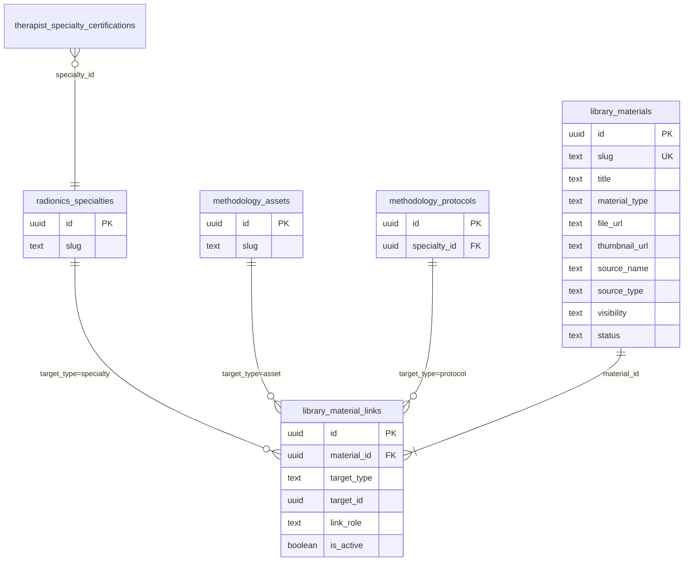
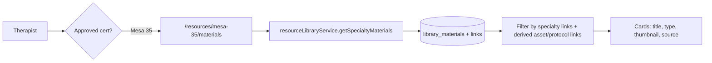

# RADIONICS — Materials Library V2.8A (Architecture)

**Status:** Approved — schema implemented in V2.8B
**Phase:** V2.8A — architecture (see `RADIONICS_MATERIALS_LIBRARY_V2_8B_SCHEMA.md` for SQL)
**Depends on:** Resources V2.7, Knowledge Layer V2.6, Methodology Core V2.1, Certifications Phase 1

---

## 1. Decision record (ADR)

### Context

The Resources module (`/resources/:specialtySlug/...`) already exposes:

| Tab | State |
|-----|--------|
| Assets | Live |
| Protocols | Live |
| Activations | Live |
| **Materials** | Placeholder (`ResourceMaterialsPage`) |

Therapists need **educational and support content** (manuals, course PDFs, training videos, reference sheets) separate from **therapeutic methodology assets** (graphs, angels, chakras, Hawkins levels).

An early sketch in `RADIONICS_METHODOLOGY_DATA_MODEL.md` proposed `reference_materials` (specialty-scoped, one row per specialty). That model does **not** support:

- One PDF linked to multiple specialties, assets, and protocols
- Polymorphic associations (asset guide, protocol video, specialty handbook)
- Reuse of a single file without duplication

### Decision

Introduce a **Materials Library** as a first-class catalog:

1. **`library_materials`** — one row per distinct learning resource (canonical file/metadata).
2. **`library_material_links`** — many-to-many associations to specialties, assets, protocols (extensible targets).
3. **No file duplication** — `file_url` lives on the material; links only reference entities.
4. **Access** — same philosophy as Resources V2.7: therapist reads materials only when certified for at least one **granting** specialty derived from links.
5. **Separation from assets** — materials are never `methodology_assets` and are not used in session activation workflows.

### Alternatives considered

| Option | Rejected because |
|--------|------------------|
| Store materials in `methodology_assets` with `asset_type = reference` | Blurs therapeutic vs educational semantics; breaks session/workflow assumptions |
| `reference_materials` with `specialty_id` FK only | Cannot share one PDF across Mesa 35 + MAP without duplicate rows/files |
| Embed materials in `specialty_asset_content.metadata` | No cross-entity links; poor search and admin ergonomics |
| Files only in Storage with path conventions | No structured metadata, linking, or RLS at row level |

### Consequences

- New tables and RLS policies (V2.8B/C).
- `resourceLibraryService` extended with `getSpecialtyMaterials()` (V2.8D).
- Storage bucket for materials is a **later** phase (V2.8F+); V2.8A only defines `file_url` / `thumbnail_url` as opaque URLs (e.g. Bunny CDN).
- Early `reference_materials` sketch is **superseded** by this model.

---

## 2. Domain model

### 2.1 Asset vs Material

| | **Asset** (`methodology_assets`) | **Material** (`library_materials`) |
|---|----------------------------------|-------------------------------------|
| Purpose | Therapeutic element for analysis / activation | Document or learning resource |
| Used in | Sessions, workspace, protocols (as component) | Resources tab, future learning paths |
| Examples | Graph, Angel, Chakra, Hawkins level | Mesa 35 Handbook, Vanessa course PDF, training video |
| Image semantics | `image_url` = UI preview; `print_image_url` = print layout | `file_url` = content; `thumbnail_url` = card preview |
| Certification gate | Via specialty content / tools | Via material links → specialty |

**Rule:** If a therapist uses it **during** a session workflow, it is an asset. If they **read or watch** it for learning, it is a material.

### 2.2 Association examples

| Material | Links |
|----------|-------|
| Complete Mesa 35 Handbook | `specialty` → Mesa 35 |
| Anti-Magic Graph Guide | `asset` → Anti-Magic (+ implicit Mesa 35 via asset context) |
| Prosperity Protocol Explanation Video | `protocol` → Prosperity (+ Mesa 49 via protocol) |
| Vanessa Radiônica Course PDF | `specialty` → Mesa 35; `source_name` = Vanessa |

A single PDF **"Introduction to Radionics"** may link to:

- `specialty` → Mesa 35
- `specialty` → Mesa 49
- `specialty` → MAP

…with **one** `library_materials` row and **three** link rows.

### 2.3 Teacher / source

Provenance is stored on the **material** (aligned with protocols and knowledge layer):

- `source_name` — e.g. Vanessa, MAP Official, Radionics App
- `source_type` — `teacher`, `official`, `app_created`, `external`

Links do **not** duplicate source metadata. Optional future `target_type = teacher` if a `teachers` catalog is introduced.

---

## 3. Proposed tables

### 3.1 `library_materials`

Canonical catalog entry — **one row per distinct resource file or external URL**.

| Column | Type | Notes |
|--------|------|-------|
| `id` | uuid PK | `gen_random_uuid()` |
| `slug` | text NOT NULL | Global unique; URL-safe (`mesa-35-handbook`) |
| `title` | text NOT NULL | Display title |
| `description` | text | Short summary for cards/detail |
| `material_type` | text NOT NULL | See §3.3 |
| `file_url` | text | CDN URL for pdf/image/video/audio/document; NULL for pure `link` |
| `external_url` | text | For `link` type or embed fallback |
| `thumbnail_url` | text | Card/preview image |
| `duration_seconds` | integer | Video/audio; NULL otherwise |
| `file_size_bytes` | bigint | Optional; for download UX |
| `language` | text | e.g. `pt`, `pt-BR`, `en` |
| `source_name` | text | Teacher or publisher display name |
| `source_type` | text NOT NULL | See §3.4 |
| `content_version` | text NOT NULL | Default `v1` |
| `is_app_adapted` | boolean NOT NULL | Default `false` |
| `visibility` | text NOT NULL | See §3.5 |
| `status` | text NOT NULL | `active`, `inactive`, `draft`, `archived` |
| `sort_order` | integer NOT NULL | Default 0; list ordering within specialty |
| `metadata` | jsonb NOT NULL | Extensible (tags, ISBN, chapter list, embed config) |
| `created_at` | timestamptz | |
| `updated_at` | timestamptz | trigger `set_updated_at()` |

**Constraints**

- `UNIQUE (slug)`
- `CHECK material_type IN (...)`
- `CHECK source_type IN (...)`
- `CHECK visibility IN (...)`
- `CHECK status IN (...)`
- `CHECK char_length(trim(title)) > 0`
- `CHECK (material_type <> 'link' OR external_url IS NOT NULL OR file_url IS NOT NULL)` — link must have a destination

**Indexes (proposed)**

- `status`, `material_type`, `visibility`
- `source_type`
- GIN on `metadata` (optional, future search)
- `title` trgm or FTS (future V2.8D search)

### 3.2 `library_material_links`

Many-to-many **association** table — no file fields.

| Column | Type | Notes |
|--------|------|-------|
| `id` | uuid PK | |
| `material_id` | uuid FK → `library_materials` ON DELETE CASCADE | |
| `target_type` | text NOT NULL | See §3.6 |
| `target_id` | uuid NOT NULL | Polymorphic FK (no single DB FK constraint) |
| `link_role` | text | Optional: `primary`, `supplementary`, `handbook`, `video_explanation` |
| `sort_order` | integer NOT NULL | Default 0 |
| `notes` | text | Admin/editorial note (not shown to therapist by default) |
| `is_active` | boolean NOT NULL | Default `true` |
| `created_at` | timestamptz | |

**Constraints**

- `UNIQUE (material_id, target_type, target_id)` — one link per pair
- `CHECK target_type IN (...)`

**Indexes**

- `(material_id)`
- `(target_type, target_id)`
- `(target_type, target_id, is_active)` partial where `is_active`

**Integrity (application / trigger layer — V2.8B)**

Polymorphic `target_id` validated on insert/update:

| `target_type` | Valid `target_id` references |
|---------------|------------------------------|
| `specialty` | `radionics_specialties.id` |
| `asset` | `methodology_assets.id` |
| `protocol` | `methodology_protocols.id` |

Future: `tool`, `teacher`, `methodology_tool`.

### 3.3 `material_type`

| Value | `file_url` | `external_url` | Therapist UX |
|-------|------------|----------------|--------------|
| `pdf` | Required | — | Open/download PDF |
| `document` | Required | — | Generic document (docx, etc.) |
| `image` | Required | — | Image viewer |
| `video` | Required or embed | Optional embed | Player + `duration_seconds` |
| `audio` | Required | — | Player + `duration_seconds` |
| `link` | Optional | Required | External link (YouTube, site) |

> `text` from early sketches is folded into `document` or inline content in `metadata` — avoid a separate type unless needed.

### 3.4 `source_type`

| Value | Meaning |
|-------|---------|
| `teacher` | Course / teacher original material |
| `official` | Official methodology publisher |
| `app_created` | Produced by Radionics app team |
| `external` | Third-party reference |

Aligns conceptually with knowledge layer `source_type` but uses a **material-specific** enum (simpler therapist labels).

### 3.5 `visibility`

| Value | Therapist access |
|-------|------------------|
| `certified_only` | Default — requires certification grant (§5) |
| `admin_only` | Admins only (draft review) |
| `public_preview` | Reserved — future public marketing pages |

### 3.6 `target_type` (links)

| Value | Grants access via |
|-------|-------------------|
| `specialty` | `has_approved_specialty_certification(target_id)` |
| `asset` | Asset appears in a certified specialty (via `specialty_tools` + `specialty_asset_content` or protocol membership) |
| `protocol` | `methodology_protocols.specialty_id` + certification |

**Grant resolution:** A material is readable if **any active link** yields an approved specialty for the therapist (OR admin).

---

## 4. Relationship diagram



### Read path (Resources UI — future V2.8E)



---

## 5. RLS strategy

Follow Resources V2.7: **certification is the gate**; admin bypass via `is_radionics_admin()`.

Reuse existing helpers:

- `public.is_radionics_admin()`
- `public.has_approved_specialty_certification(p_specialty_id uuid)`

### 5.1 Proposed helper (V2.8C)

```sql
-- Pseudocode — implement in migration after approval
public.can_read_library_material(p_material_id uuid) returns boolean
```

Returns true when:

1. Caller is admin, **or**
2. Material `status = 'active'` AND `visibility = 'certified_only'` AND exists active link granting specialty:

| Link type | Grant condition |
|-----------|-----------------|
| `specialty` | `has_approved_specialty_certification(target_id)` |
| `protocol` | `has_approved_specialty_certification(protocol.specialty_id)` |
| `asset` | Exists certified specialty where asset is in scope: |

```sql
-- Asset grant (conceptual)
exists (
  select 1 from public.specialty_tools st
  join public.methodology_assets ma on ma.tool_id = st.tool_id
  where ma.id = link.target_id
    and st.is_active
    and public.has_approved_specialty_certification(st.specialty_id)
)
or exists (
  select 1 from public.protocol_assets pa
  join public.methodology_protocols mp on mp.id = pa.protocol_id
  where pa.asset_id = link.target_id
    and mp.status = 'active'
    and public.has_approved_specialty_certification(mp.specialty_id)
)
```

### 5.2 Table policies

| Table | Therapist SELECT | Admin |
|-------|------------------|-------|
| `library_materials` | `can_read_library_material(id)` | Full |
| `library_material_links` | Material readable OR link target certifiable (for join queries) | Full |

**INSERT/UPDATE/DELETE:** admin only in V2.8B/C (no therapist upload).

### 5.3 Storage (future — not V2.8A)

Separate bucket e.g. `radionics-materials` with path:

```txt
radionics/materials/{material_id}/{filename}
```

RLS on `storage.objects` mirrors `can_read_library_material` via material_id in path. **Deferred** to upload phase.

### 5.4 Service-layer parity

`resourceLibraryService` already calls `assertApprovedSpecialty(slug)` before reads. Materials service will:

1. Resolve specialty from slug.
2. Query materials with links for that specialty (direct + via assets/protocols in specialty).
3. Rely on Supabase RLS as second line of defense (same pattern as V2.7).

---

## 6. Query patterns (read layer — future V2.8D)

### List materials for specialty

```sql
-- Conceptual: materials linked directly to specialty
select m.*
from library_materials m
join library_material_links l on l.material_id = m.id
where l.target_type = 'specialty'
  and l.target_id = :specialty_id
  and l.is_active
  and m.status = 'active';

-- Union: materials linked to assets in specialty tools
-- Union: materials linked to protocols in specialty
```

Prefer a **single SQL view** or RPC `get_specialty_library_materials(p_specialty_id)` for consistent RLS and performance.

### Material detail with related entities

Return material + `links[]` with resolved labels (asset name, protocol name) for breadcrumbs in UI.

### Search

Extend `searchResources()` or add `searchMaterials()`:

- `title`, `description`, `source_name`
- Tags in `metadata`
- Filter by `material_type`

---

## 7. Metadata examples

```json
{
  "tags": ["handbook", "beginner"],
  "page_count": 48,
  "embed": {
    "provider": "youtube",
    "video_id": "abc123"
  },
  "chapters": [
    { "title": "Introdução", "page": 1 }
  ]
}
```

No schema migration needed for new keys — `metadata jsonb` on material row.

---

## 8. Out of scope (V2.8A)

| Item | Target phase |
|------|--------------|
| SQL migrations | V2.8B (after approval) |
| RLS policies | V2.8C |
| `resourceLibraryService` methods | V2.8D |
| `/resources/:slug/materials` UI | V2.8E |
| Upload UI / admin panel | V2.8F+ |
| Storage bucket + CDN wiring | V2.8F+ |
| Learning progress / completion | Future |
| Versioning / material revisions table | Future (use `content_version` + new row for now) |

---

## 9. Migration plan (post-approval)

### V2.8B — Schema

1. Create `library_materials` + `library_material_links`.
2. Add comments documenting asset vs material separation.
3. Add indexes and CHECK constraints.
4. Optional: `validate_library_material_link()` trigger for polymorphic integrity.
5. **No data import** in same migration.

### V2.8C — RLS

1. `can_read_library_material(uuid)` function.
2. Enable RLS on both tables.
3. Admin CRUD policies.
4. Therapist SELECT policies.
5. Grant execute on helper to `authenticated`.

### V2.8D — Service layer

1. Types: `LibraryMaterial`, `LibraryMaterialLink`, `MaterialType`.
2. `getSpecialtyMaterials(slug)`, `getMaterialDetail(slug, materialSlug)`.
3. `searchMaterials(query)`.
4. Update `getSpecialtyResources()` → `materialCount`.
5. Mock data parity for dev mode.

### V2.8E — Resources UI

1. Replace `ResourceMaterialsPage` placeholder.
2. Cards by type (PDF, video, link).
3. Detail view / open file / external link.
4. Optional: materials section on asset/protocol detail pages (linked materials).

### V2.8F — Content & storage

1. Bunny bucket `radionics-materials`.
2. Seed imports (handbooks, course PDFs).
3. Admin upload tooling.

### V2.8G — Cross-links in knowledge imports

When importing protocols/assets, add `library_material_links` rows in SQL seeds where appropriate.

---

## 10. Validation checklist (post-implementation)

- [ ] Material linked to Mesa 35 only → visible to Mesa 35 certified therapist, not Mesa 49-only.
- [ ] Same PDF linked to Mesa 35 + MAP → one `library_materials` row, two links, both audiences see it.
- [ ] Asset guide link → visible when therapist certified for a specialty that includes that asset.
- [ ] Protocol video link → visible when certified for protocol's specialty.
- [ ] `status = draft` / `visibility = admin_only` → hidden from therapists.
- [ ] Uncertified therapist → 403 UX + RLS deny.
- [ ] Materials never appear in session asset pickers or workflow engine.

---

## 11. Naming note

| Concept | Table |
|---------|--------|
| Materials catalog | `library_materials` |
| Associations | `library_material_links` |

Prefix `library_` avoids collision with:

- `methodology_assets` (therapeutic)
- `course_material` (source_type enum value)
- Legacy `reference_materials` sketch (deprecated)

App types may use `LibraryMaterial` / `MaterialResource` in TypeScript.

---

## 12. Approval gate

**Do not create SQL** until this document is approved.

Open questions for product sign-off:

1. Should asset-only links require an explicit specialty link for clarity, or is derived grant sufficient?
2. Is `public_preview` needed in v1 or defer?
3. Global `slug` uniqueness vs `(specialty_id, slug)` — proposed **global** slug for simpler CDN paths and cross-specialty sharing.

---

## References

- `docs/Engine/RADIONICS_RESOURCES_MODULE_V2_7.md`
- `docs/Engine/RADIONICS_KNOWLEDGE_LAYER_V2_6A_SCHEMA.md`
- `supabase/migrations/20260531260000_radionics_resource_library_rls_v2_7.sql`
- `supabase/migrations/20260531150000_radionics_methodology_core_v2.sql` (`activation_script_links` pattern)
- `docs/Engine/RADIONICS_METHODOLOGY_DATA_MODEL.md` (legacy `reference_materials` — superseded)
