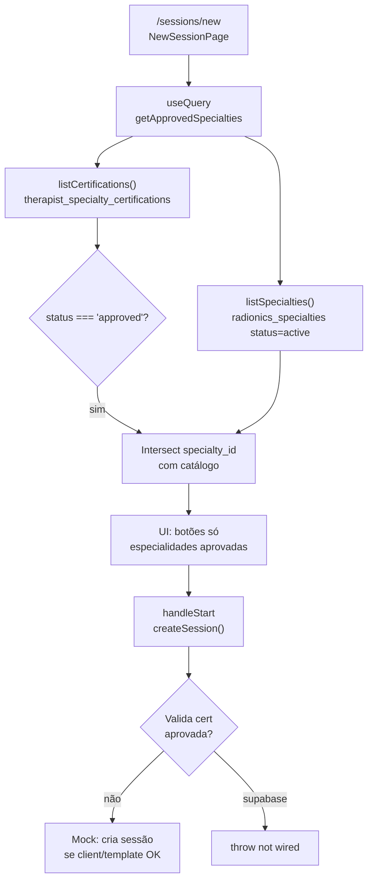

# RADIONICS — Auditoria: gate de especialidades no wizard `/sessions/new`

**Date:** 2026-05-31
**Scope:** Nova sessão — especialidades disponíveis vs certificações aprovadas
**Classificação global:** **Parcialmente seguro** (leitura correta na UI; escrita sem revalidação no service)

---

## Resumo executivo

O wizard **usa** `getApprovedSpecialties()` como fonte da lista de especialidades, que por sua vez cruza o catálogo activo com `therapist_specialty_certifications` filtrado por `status = 'approved'` e terapeuta autenticado (em Supabase via RLS).

**Não existe** validação equivalente em `createSession()` — quem contornar a UI (DevTools, chamada directa ao service) pode criar sessão sem certificação aprovada no modo mock.

Em `VITE_DATA_MODE=supabase`, `createSession()` ainda não está ligado ao Postgres (`supabaseNotWired`), pelo que o risco de persistência indevida é limitado até a fase de sessões Supabase.

---

## Fluxo actual (diagrama)



---

## Checklist de validação

### 1. De onde vêm as especialidades mostradas no wizard?

| Camada | Origem |
|--------|--------|
| Página | `src/pages/sessions/NewSessionPage.tsx` |
| Query | `useQuery({ queryKey: ['approved-specialties'], queryFn: getApprovedSpecialties })` |
| Service | `getApprovedSpecialties()` em `src/services/specialtiesService.ts` |

**Não** usa directamente `getSpecialties()` na UI do wizard — apenas via composição dentro de `getApprovedSpecialties()`.

---

### 2. Usa `therapist_specialty_certifications`?

| Modo | Comportamento |
|------|----------------|
| **Mock** | Sim — `getMyCertifications()` → store `CERTIFICATIONS` (espelha `therapist_specialty_certifications`) |
| **Supabase** | Sim — `listCertifications()` → `SELECT * FROM therapist_specialty_certifications` com RLS `therapist_id = auth.uid()` |

O catálogo (`listSpecialties` / `radionics_specialties`) fornece nome, slug, descrição; a **elegibilidade** vem da tabela de certificações.

---

### 3. Filtra `status = 'approved'`?

**Sim**, em `getApprovedSpecialties()`:

```154:159:src/services/specialtiesService.ts
export async function getApprovedSpecialties(): Promise<Specialty[]> {
  const [specialties, certs] = await Promise.all([listSpecialties(), getMyCertifications()]);
  const approvedIds = new Set(
    certs.filter(c => c.status === 'approved').map(c => c.specialtyId),
  );
  return specialties.filter(s => approvedIds.has(s.id));
}
```

**Lacuna:** não exclui certificações com `expires_at` no passado se o registo ainda tiver `status = 'approved'`. Não filtra `expired` explicitamente (estado separado no modelo).

---

### 4. Filtra pelo terapeuta autenticado?

| Modo | Comportamento |
|------|----------------|
| **Mock** | Parcial — `getMyCertifications()` filtra `therapistId === 'therapist-001'` (fixo) |
| **Supabase** | Sim — RLS em `therapist_specialty_certifications` limita SELECT/INSERT ao `auth.uid()` |

`listSpecialties()` é catálogo global (especialidades `active`); o filtro por terapeuta aplica-se só na lista de certificações.

---

### 5. É possível aceder a especialidade pending/rejected via URL ou manipulação frontend?

| Vector | Resultado |
|--------|-----------|
| **Query string** `/sessions/new?specialty=…` | Não existe — rota sem parâmetros de especialidade |
| **Lista UI** | Só renderiza `approvedSpecialties` — pending/rejected não aparecem como botões |
| **Estado React** (`selectedSpecialty`) | Teoricamente alterável via DevTools — não há revalidação em `handleStart` |
| **Saltar passos do wizard** | Possível avançar estado local sem clicar lista; `handleStart` não re-verifica cert |
| **Chamada directa** `createSession({ specialtyId: '…' })` | **Sem bloqueio** — service não consulta certificações |

**Conclusão:** para utilizador normal, **não** escolhe pending/rejected na UI. Para atacante com acesso ao browser ou API mock, **sim** — contorno possível.

---

### 6. A criação da sessão valida novamente no service/backend?

**Não** (modo mock):

```37:53:src/services/sessionsService.ts
export async function createSession(input: {
  clientId: string;
  specialtyId: string;
  templateId: string;
  ...
}): Promise<Session> {
  ...
  const client = CLIENTS.find(c => c.id === input.clientId);
  const methodology = METHODOLOGIES.find(m => m.id === input.specialtyId);
  const template = TEMPLATES.find(t => t.id === input.templateId);

  if (!client || !methodology || !template) {
    throw new Error('Invalid client, specialty or template');
  }
```

Valida apenas existência de cliente, metodologia (ID legado mock) e template — **não** `therapist_specialty_certifications` nem `status = 'approved'`.

**Supabase:** `createSession` chama `supabaseNotWired('sessions.createSession')` — sem persistência real.

**Postgres/RLS:** não há migration de sessões RADIONICS aplicada nesta fase; não existe policy de INSERT em sessões que exija certificação aprovada.

---

### 7. Existe dupla validação (UI + service)?

| Camada | Gate de certificação aprovada |
|--------|------------------------------|
| **UI** (`getApprovedSpecialties` + lista) | Sim |
| **Service leitura** (`getApprovedSpecialties`) | Sim |
| **Service escrita** (`createSession`) | **Não** |
| **Backend / RLS sessões** | **Não implementado** |

**Classificação desta pergunta:** **Apenas UI** para o caminho de criação de sessão.

---

## Detalhes adicionais relevantes

### Mapeamento especialidade → metodologia (mock legado)

`NewSessionPage` envia para `createSession`:

```60:62:src/pages/sessions/NewSessionPage.tsx
      const session = await createSession({
        clientId: selectedClient.id,
        specialtyId: mapSpecialtyToMethodologyId(selectedSpecialty.id),
```

`mapSpecialtyToMethodologyId` só conhece 3 IDs fixos (`spec-map`, `spec-rad35`, `spec-rad49`). Especialidades novas aprovadas via Supabase (UUID) **não** mapeiam para templates mock — risco funcional, não de segurança de cert.

### Templates no wizard

`availableTemplates` filtra `TEMPLATES` mock por `methodologyId` — independente de Supabase. Gate de certificação não valida template no backend.

### Protecção de rota

`/sessions/new` está em `ProtectedWithLayout` → `RequireSupabaseAuth` apenas em modo Supabase (login). **Não** exige admin nem certificação para aceder à página.

### Dados mock de demonstração

- `spec-map` → cert `approved` → aparece no wizard
- `spec-rad35` → cert `pending` → **não** aparece
- `spec-rad49` → sem cert / `not_certified` → **não** aparece

Comportamento alinhado com a regra de negócio para demo local.

---

## Classificação por camada

| Camada | Classificação | Notas |
|--------|---------------|-------|
| Lista wizard (`getApprovedSpecialties`) | **Seguro** (leitura) | approved + terapeuta (RLS) + catálogo active |
| UI apenas (sem revalidação no submit) | **Apenas UI** | Estado React / DevTools |
| `createSession` mock | **Apenas UI** | Sem check de certificação |
| `createSession` supabase | N/A (não wired) | Erro explícito até implementar sessões |
| RLS / DB sessões | **Não implementado** | Futuro: trigger ou policy obrigatória |

### Classificação global recomendada

**Parcialmente seguro**

- **Seguro** para utilizador que só usa a interface normal e confia em `getApprovedSpecialties`.
- **Não seguro** como garantia de integridade se a escrita de sessão for exposta sem segunda validação server-side.

---

## Recomendações (futuro — fora deste audit)

1. **`assertApprovedSpecialtyForSession(specialtyId)`** chamado no início de `createSession()` (mock + Supabase).
2. **Supabase:** policy ou função `SECURITY DEFINER` no INSERT de `sessions` / `radionics_session_details` que verifica `EXISTS (… status = 'approved' AND (expires_at IS NULL OR expires_at > now()))`.
3. **`getApprovedSpecialties`:** excluir `expired` e certificações com `expires_at` passado.
4. **Wizard `handleStart`:** revalidar que `selectedSpecialty.id` está na lista `approvedSpecialties` antes de `createSession`.
5. Remover ou generalizar `mapSpecialtyToMethodologyId` quando sessões usarem `specialty_id` UUID real.

---

## Ficheiros auditados

| Ficheiro | Papel |
|----------|--------|
| `src/pages/sessions/NewSessionPage.tsx` | Wizard UI |
| `src/services/specialtiesService.ts` | `getApprovedSpecialties` |
| `src/services/certificationsService.ts` | `listCertifications` |
| `src/services/sessionsService.ts` | `createSession` |
| `src/services/supabase/certificationsSupabase.ts` | Query certs Supabase |
| `src/routes/index.tsx` | Rota protegida por auth |
| `supabase/migrations/20260531120000_radionics_specialties_phase1.sql` | UNIQUE + RLS certs |

---

## Validação deste documento

Auditoria estática de código — sem alteração de implementação nesta tarefa.
