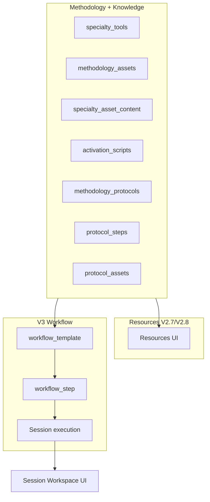

# RADIONICS — V3.0 Workflow Engine Plan

**Status:** V3.0A.1 — Planning + approved design decisions (pre–V3.0B)
**Date:** 2026
**Depends on:** Methodology Core V2.1, Asset Media V2.4, Knowledge Layer V2.6, Resources V2.7, Materials V2.8

---

## 1. Objetivo

O **Workflow Engine** define como uma especialidade certificada se torna uma **sessão guiada executável**.

Até V2.8, a plataforma provou que consegue **ler** metodologia de forma estruturada (fora do workspace):

- especialidades certificadas
- ferramentas (`specialty_tools`)
- assets (`methodology_assets` + media + content)
- scripts de ativação
- protocolos, passos e assets ligados
- materiais educacionais

O V3.0 fecha o ciclo: o **mesmo motor de conhecimento** que alimenta Recursos passa a **orquestrar** o que o terapeuta faz, em que ordem, com que ferramentas e que outputs persistir — sem depender de templates fixos em `mock-data.ts`.

> Uma metodologia descreve **o que existe**. Um workflow descreve **quando e como usar** durante uma sessão.

---

## 2. Separação de responsabilidades

| Camada | Pergunta que responde | Consumidor principal |
|--------|----------------------|----------------------|
| **Methodology Engine** | O que existe no catálogo? (tools, assets, tipos) | Todos |
| **Knowledge Layer** | O que cada asset/protocolo **significa**? (descrição, ativação, passos, proveniência) | Resources, Workflow, Reports |
| **Resources** | O terapeuta pode **consultar** livremente? | `/resources` (read-only, sem sessão) |
| **Materials Library** | Que documentos de apoio existem? | `/resources/.../materials` |
| **Workflow Engine** | Qual é o **roteiro executável** da sessão? | Wizard + Workspace |
| **Session Workspace** | Como o terapeuta **interage** passo a passo? | `/sessions/:id` (UI) |

### Regras de fronteira

- **Resources ≠ Workflow** — consultar um gráfico em Recursos não cria estado de sessão.
- **Protocolos ≠ Workflows** — um protocolo é conhecimento reutilizável; o workflow decide *se* e *quando* o protocolo entra na sessão.
- **Assets ≠ Steps** — um asset é selecionável/ativável; um step define contexto, ordem e output esperado.
- **Workspace ≠ Schema** — a UI executa; o workflow engine fornece definição + validação + resolução de conteúdo.



---

## 3. Problema atual

O workspace e o wizard de nova sessão ainda dependem de artefactos **legados e fixos**:

| Área | Estado atual | Gap |
|------|--------------|-----|
| Templates | `TEMPLATES` em `mock-data.ts`; filtro via `sessionTemplates.ts` | Não lê `specialty_tools` nem workflows da BD |
| Stages da sessão | Hardcoded em `createSession()`: preparation, connection, diagnosis, activations, closing | Não reflete Mesa 35 vs 49 vs MAP |
| Diagnóstico / ativação | Subconjunto mock (ex.: 8 gráficos na UI vs 35 no seed) | Não consome `methodology_assets` + `specialty_asset_content` |
| Hawkins | Níveis em catálogo; UI parcial | Não integrado com knowledge + workflow |
| Protocolos | Disponíveis em Resources V2.7 | **Não** selecionáveis nem executáveis no workspace |
| Ativações | Scripts na knowledge layer + RLS Resources | Workspace não usa `activation_scripts` de forma sistemática |
| Persistência | `toolResults`, `fieldValues`, `stages` em mock local | V3: `workflow_template_id`, `workflow_version`, `workflow_state` jsonb |

### Tabelas já existentes mas subutilizadas no workspace

- `specialty_tools` — ferramentas visíveis/obrigatórias por especialidade
- `methodology_assets` — catálogo completo de gráficos, anjos, chakras, etc.
- `specialty_asset_content` — texto de ativação, explicação, metadata
- `methodology_asset_media` — imagens por especialidade/ferramenta
- `activation_scripts` + `activation_script_links`
- `methodology_protocols` + `protocol_assets` + `protocol_steps`

O Resources module validou o **read path**. O V3.0 deve reutilizar os mesmos serviços/mappers, com camada de **orquestração** por cima.

---

## 4. Fluxo alvo

```
Especialidade certificada
        ↓
Ferramentas de metodologia disponíveis (specialty_tools)
        ↓
Assets resolvíveis por ferramenta + content + media
        ↓
Protocolos disponíveis (methodology_protocols)
        ↓
Workflow template da especialidade (workflow_template + steps)
        ↓
Passos de sessão (workflow_step → UI components)
        ↓
Seleções / medições / ativações (step_output persistido)
        ↓
Secções do relatório (derivadas do workflow + outputs)
```

### Entrada do terapeuta (wizard — evolução)

```
Nova sessão
  → Especialidade (certificação approved) ✓ já existe
  → Workflow ou Template legado (coexistência temporária)  ← V3
  → Cliente + intenção                                    ✓ já existe
  → Workspace dinâmico                                    ← V3
```

Quando existir `workflow_template` ativo para a especialidade, o wizard prefere **Workflow**; caso contrário, mantém **Template** legado (`TEMPLATES` mock) como fallback.

---

## 5. Modelo de workflow proposto

### 5.1 Conceitos

| Conceito | Descrição |
|----------|-----------|
| **`workflow_template`** | Roteiro versionado por especialidade (ex.: «Mesa 35 — Sessão completa»). Um default por specialty; futuros: express, follow-up. |
| **`workflow_step`** | Passo ordenado dentro do template. Tem `step_type`, label, instruções, config. |
| **`step_tool`** | Ferramenta(s) de metodologia usada no passo (`methodology_tools.id` ou slug). Ex.: `graph-set-35`, `hawkins-scale`. |
| **`step_asset_scope`** | Regra de quais assets são elegíveis: tool inteira, subset por role, protocol-linked, ou livre dentro da tool. |
| **`step_output`** | Schema do que a sessão deve persistir ao completar o passo (seleções, medições, notas, flags). |

### 5.2 Tipos de passo (`step_type`)

| Tipo | Propósito | Exemplo Mesa 35 |
|------|-----------|-----------------|
| `preparation` | Intenção, ambiente, consentimento | Preparação inicial |
| `connection` | Ligação / testemunha / campo | Conexão radiônica |
| `measurement` | Leitura numérica ou escala (genérico) | Hawkins: `tool_slug=hawkins-scale`, `mode=initial\|final` |
| `diagnosis` | Seleção analítica sem ativação | Diagnóstico por gráficos |
| `selection` | Escolha de elementos (anjos, causas, etc.) | Seleção de anjos |
| `activation` | Ativação com scripts + confirmação | Ativação de gráficos |
| `protocol` | Escolha e execução guiada de protocolo | Protocolo prosperidade |
| `closing` | Encerramento, reverberação | Encerramento |
| `report` | Revisão / geração de secções | Relatório |

Tipos são **extensíveis**; a UI do workspace mapeia `step_type` → componente (adapter pattern).

### 5.3 Configuração por passo (`config jsonb`)

**Medição (Hawkins)** — `step_type = measurement` (sem tipo dedicado):

```json
{
  "measurement": {
    "tool_slug": "hawkins-scale",
    "mode": "initial"
  }
}
```

Valores de `mode`: `initial`, `final` (e extensível para outras escalas no futuro).

**Seleção / diagnóstico / ativação:**

```json
{
  "asset_picker": { "tool_slug": "graph-set-35", "multi": true, "max": 5 },
  "protocol": { "allow_browse": true, "filter_by_specialty": true, "inline": true },
  "activation": { "require_script_read": false, "show_image": true },
  "output_schema": {
    "fields": ["selected_asset_ids", "hawkins_value", "notes"]
  }
}
```

**Passos condicionais (v1 — lógica simples em JSONB, sem rule engine):**

```json
{
  "condition": {
    "requires_asset_type": "graph"
  }
}
```

O runtime avalia a condição contra o estado da sessão (ex.: protocolo selecionado inclui asset do tipo `graph` em `protocol_assets`). Passos cuja condição falha são **skipped** automaticamente ou ocultos na UI — comportamento exacto definido em V3.0C.

Exemplos de chaves `condition` suportadas em v1 (proposta):

| Chave | Significado |
|-------|-------------|
| `requires_asset_type` | Exige que o protocolo/sessão atual referencie esse `asset_type` |
| `requires_protocol_selected` | Passo só visível após `selected_protocol_id` no `workflow_state` |

Sem DSL, sem motor de regras externo — apenas predicates documentados no adapter.

### 5.4 Proposta de schema V3.0B (documentação apenas — sem implementação)

Com base nas decisões V3.0A.1, a fase **V3.0B** deve documentar e depois migrar o seguinte modelo mínimo.

#### `workflow_templates`

| Coluna | Notas |
|--------|-------|
| `id` | uuid PK |
| `specialty_id` | FK → `radionics_specialties` |
| `slug` | único por `(specialty_id, slug, version)` |
| `name` | ex.: «Mesa 35 — Sessão completa» |
| `version` | text NOT NULL — ex.: `v1`, `v1.1` (obrigatório versionar) |
| `status` | `active`, `inactive`, `draft`, `archived` |
| `is_default` | boolean — template default do wizard para a specialty |
| `metadata` | jsonb |
| `created_at`, `updated_at` | |

**Versionamento:** alterações estruturais criam nova linha (novo `version`), não overwrite silencioso. Sessões antigas referenciam `workflow_template_id` + `workflow_version` imutáveis.

#### `workflow_steps`

| Coluna | Notas |
|--------|-------|
| `id` | uuid PK |
| `workflow_template_id` | FK |
| `step_order` | integer > 0 |
| `step_code` | slug estável dentro do template — ex.: `hawkins_initial` |
| `step_type` | enum §5.2 (`measurement`, `protocol`, …) |
| `label` | UI |
| `instructions` | text opcional |
| `config` | jsonb — measurement, asset_picker, **condition**, output_schema |
| `status` | `active`, `inactive` |

Passos em tabela dedicada (não embutidos só no template) — facilita queries e seeds por specialty.

#### Sessão — persistência V1

| Campo | Local proposto | Notas |
|-------|----------------|-------|
| `workflow_template_id` | coluna sessão ou `radionics_session_details` | FK opcional nullable durante coexistência |
| `workflow_version` | text | cópia no momento do start — integridade histórica |
| `workflow_state` | **jsonb** | estado vivo: passos, outputs, seleções, protocol_id |

**Não** criar tabelas normalizadas `session_step_outputs` em V1. Analytics/eventos podem vir em V3.2+.

Exemplo `workflow_state`:

```json
{
  "current_step_id": "uuid",
  "steps": {
    "hawkins_initial": {
      "status": "completed",
      "outputs": { "hawkins_value": 350 },
      "completed_at": "2026-06-15T10:05:00Z"
    },
    "protocol_select": {
      "status": "completed",
      "outputs": { "selected_protocol_id": "uuid" }
    }
  },
  "legacy_adapter": { "mapped_stage_code": "diagnosis" }
}
```

#### RLS (V3.0B)

Mesma filosofia que Resources:

- **Terapeuta:** SELECT em `workflow_templates` / `workflow_steps` quando `has_approved_specialty_certification(specialty_id)` e `status = active`.
- **Admin:** CRUD completo via `is_radionics_admin()`.

Função helper proposta: `can_read_workflow_template(template_id uuid)` (espelho de `can_read_library_material`).

#### Fora do scope V3.0B

- Seeds de workflows Mesa 35/49 (V3.0D+ / seeds dedicados)
- Colunas em produção em `sessions` até adapter validado (pode começar mock-only)
- UI admin de edição de workflows

---

## 6. Exemplos de workflows

### 6.1 Mesa 35 (35 gráficos + Hawkins + chakras)

| Ordem | step_type | step_tool / scope | Output |
|-------|-----------|-------------------|--------|
| 1 | preparation | — | intention, notes |
| 2 | connection | — | connection_ok |
| 3 | measurement | hawkins-scale | hawkins_initial |
| 4 | diagnosis | graph-set-35 | selected_graph_ids |
| 5 | activation | graph-set-35 | activated_graph_ids, timestamps |
| 6 | selection | chakra-set | selected_chakra_ids |
| 7 | measurement | hawkins-scale | hawkins_final |
| 8 | closing | — | reverberation_days, closing_notes |
| 9 | report | — | report_draft_refs |

### 6.2 Mesa 49 (anjos + protocolos)

| Ordem | step_type | scope | Output |
|-------|-----------|-------|--------|
| 1 | preparation | — | intention |
| 2 | connection | — | connection_ok |
| 3 | selection | angel-set / archangel | selected_angel_ids |
| 4 | protocol | methodology_protocols | selected_protocol_id |
| 5 | activation | protocol_assets (dynamic) | activated_assets |
| 6 | activation | graph-set-35 (conditional) | support_graph_ids |
| 7 | closing | — | closing_notes |
| 8 | report | — | report sections |

Passo 6 **condicional** (`config.condition.requires_asset_type = "graph"`): só executado se o protocolo selecionado incluir gráfico em `protocol_assets`.

### 6.3 MAP (relogio radiestésico + causas + chakras + gráficos + protocolos)

| Ordem | step_type | scope |
|-------|-----------|-------|
| 1 | preparation | — |
| 2 | connection | — |
| 3 | diagnosis | radionic-clock |
| 4 | diagnosis | cause-set / body-set |
| 5 | diagnosis | chakra-set |
| 6 | diagnosis | graph-set (MAP) |
| 7 | protocol | methodology_protocols |
| 8 | activation | protocol-driven |
| 9 | report | — |

MAP ilustra workflow com **múltiplas tools** ainda não todas seedadas — o engine deve tolerar passos com catálogo parcial (graceful degradation em dev).

---

## 7. Relação com protocolos

| Aspeto | Protocolo (Knowledge) | Workflow |
|--------|----------------------|----------|
| Natureza | Objeto de conhecimento reutilizável | Orquestração temporal da sessão |
| Conteúdo | `description`, `why_activate`, `protocol_steps`, `protocol_assets` | Quando abrir picker de protocolos, o que fazer depois |
| Assets | Ligados via `protocol_assets` | Resolvidos **após** seleção do protocolo |
| Ativação | Scripts podem existir nos assets do protocolo | Passo `activation` consome scripts via mesmo path que Resources |
| Substituição | Um protocolo **não** substitui um workflow | Workflow pode ter 0, 1 ou N passos `protocol` |

### Fluxo protocol-assisted (execução inline — v1)

Protocolos são executados **inline** dentro do fluxo do workflow. **Não** há «modo protocolo» separado na v1.

```
Passo workflow step_type=protocol (inline)
  → listar methodology_protocols (specialty, active)
  → terapeuta escolhe protocolo (persiste em workflow_state)
  → mostrar protocol_steps como conteúdo guia na mesma superfície UI
  → mostrar protocol_assets para passos activation seguintes
  → passos condicionais do workflow avaliam protocol_assets selecionado
  → persistir protocol_id + outputs no workflow_state
```

Os **passos do protocolo** (`protocol_steps`) permanecem **knowledge content** — o workflow decide *quando* os exibir; não são duplicados como `workflow_steps`.

---

## 8. Persistência de outputs

### 8.1 O que a sessão deve armazenar (modelo lógico)

| Domínio | Dados |
|---------|-------|
| **Contexto** | `specialty_id`, `workflow_template_id`, `workflow_version`, `client_id`, `session_mode`, `intention` |
| **Progresso** | `current_step_id`, `step_status` por passo (not_started / in_progress / completed / skipped) |
| **Seleções** | asset IDs por passo/tool (graphs, angels, chakras, causes) |
| **Protocolo** | `selected_protocol_id`, snapshot opcional de steps/assets no momento da sessão |
| **Medições** | Hawkins inicial/final, outras escalas |
| **Ativações** | asset_id, script_id, completed_at, optional notes |
| **Notas** | therapist notes por passo ou global |
| **Relatório** | snapshot de secções derivadas (não recalcular só do mock) |

### 8.2 Persistência V1 — `workflow_state` jsonb

Hoje: `stages[]`, `toolResults[]`, `fieldValues` (mock, pouco normalizado).

**Decisão V3.0A.1:** usar **JSONB** para estado de workflow na v1; evitar normalização prematura de outputs. Tabelas de eventos/analytics podem ser adicionadas mais tarde (V3.2+).

Campos obrigatórios na sessão (quando workflow ativo):

| Campo | Descrição |
|-------|-----------|
| `workflow_template_id` | Template usado no arranque |
| `workflow_version` | Versão fixada no arranque — integridade de relatório |
| `workflow_state` | Estado vivo (passos, outputs, progresso) |

Modelo TypeScript conceitual:

```typescript
interface SessionWorkflowState {
  templateId: string;
  templateSlug: string;
  workflowVersion: string; // cópia imutável do template.version
  currentStepId: string;
  steps: Record<string, SessionStepState>; // keyed by step_code
}

interface SessionStepState {
  stepId: string;
  stepType: WorkflowStepType;
  status: StageStatus;
  outputs: Record<string, unknown>;
  completedAt?: string;
  skipped?: boolean; // condição não satisfeita
}
```

**Princípio:** compatibilidade com sessões legadas (`templateId` mock, sem `workflow_state`) até Mesa 35 adapter estar estável (§9). Campos legados (`stages`, `toolResults`) podem ser alimentados pelo adapter a partir de `workflow_state` durante a transição.

### 8.3 Imutabilidade para relatório

Ao aprovar relatório, gravar snapshot de:

- workflow template version
- protocolo selecionado (se aplicável)
- assets ativados com nomes/aliases resolvidos na altura

Evita que alterações futuras ao catálogo reescrevam histórico.

---

## 9. Estratégia de migração

**Não reescrever o workspace de uma vez.**

| Fase | Entregável | Risco mitigado |
|------|------------|----------------|
| **V3.0A** | Plano inicial | Alinhamento |
| **V3.0A.1** | Decisões de design aprovadas (este documento) | Sign-off antes do schema |
| **V3.0B** | Schema proposal + migração SQL (`workflow_templates`, `workflow_steps`, RLS) | Proposal only até review |
| **V3.0C** | `workflowEngineService` read-only + avaliação de `condition` em config | Reutiliza methodology + knowledge |
| **V3.0D** | **Mesa 35** dynamic workspace adapter | Primeira specialty validada |
| **V3.0E** | Report integration — `workflow_version` + `workflow_state` snapshot | Integridade histórica |
| **V3.0F** | **Mesa 49** workflow (anjos + protocol inline) | — |
| **V3.0G** | Protocol-assisted sessions completos (inline + condicionais) | — |
| **V3.1+** | **MAP** workflow (após catálogo MAP maduro) | Evita rollout prematuro |

### Abordagem adapter (recomendada)

```
┌─────────────────────────────────────┐
│  Session Workspace UI (existente)    │
├─────────────────────────────────────┤
│  WorkflowAdapter (novo, por spec)   │  ← Mesa 35 primeiro
│  - map workflow_step → legacy stage │
│  - hydrate assets from engine       │
├─────────────────────────────────────┤
│  methodologyEngineService           │
│  resourceLibraryService (patterns)  │
│  workflowEngineService (novo)       │
└─────────────────────────────────────┘
```

- `meth-rad35` / `mesa-35`: adapter ativo → assets da BD/mock engine (**V3.0D**).
- `mesa-49`: após M35 validado (**V3.0F**).
- `map`: **V3.1+** (catálogo incompleto).
- Outras especialidades: fallback para template legado (`TEMPLATES` mock).
- Wizard: prefere **Workflow** quando `getWorkflowForSpecialty()` retorna template ativo; senão **Template** legado.

**Objetivo longo prazo:** substituir `TEMPLATES` mock após workflows validados specialty a specialty — não desligar legado até lá.

---

## 10. Fora de âmbito V3.0A / V3.0A.1

- SQL / migrações (V3.0B é proposal; implementação após review)
- Implementação UI workspace
- Rewrite de sessões ou relatórios
- AI / sugestões automáticas
- Materials no workflow (materiais permanecem em Resources)
- Upload / admin de workflows
- Sessões agendadas RADIANCE (integração futura)
- Tabelas normalizadas de eventos de sessão (V3.2+)
- MAP workflow (V3.1+)

---

## 11. Riscos

| Risco | Impacto | Mitigação |
|-------|---------|-----------|
| **Overengineering** | Atraso, schema excessivo | 1 workflow default por specialty; config JSONB; fases pequenas |
| **Quebrar fluxo atual** | Terapeutas em mock perdem sessões | Adapter + fallback template legado |
| **Misturar Resources com workflow** | Consulta livre altera sessão | Serviços separados; workflow só via session context |
| **Protocolos viram templates fixos** | Duplicação com `protocol_steps` | Protocolo = knowledge; workflow referencia protocol_id |
| **Persistência insuficiente** | Relatórios inconsistentes | `SessionWorkflowState` + snapshot na aprovação |
| **Catálogo incompleto (MAP)** | Passos vazios | Graceful empty states; feature flags por tool |
| **Duplicar lógica Resources** | Dois read paths divergem | Shared mappers + `methodologyEngineService` como base |

---

## 12. Recomendação

Adotar **adapter gradual specialty-by-specialty**, alinhado com V3.0A.1:

1. **V3.0B** — schema: `workflow_templates` (versionados) + `workflow_steps` + RLS certificação; documento de migração separado.
2. **V3.0C** — read service; avaliador simples de `config.condition`; sem rule engine.
3. **V3.0D** — Mesa 35: diagnóstico + ativação + `measurement` Hawkins via `tool_slug` + `mode`.
4. Coexistir com `TEMPLATES` legado; persistir `workflow_template_id`, `workflow_version`, `workflow_state` jsonb.
5. Protocolos **inline** em passo `protocol`; condicionais via JSONB.
6. **V3.0F** Mesa 49; **V3.1+** MAP.

Esta ordem maximiza reutilização V2.6–V2.8 e preserva integridade histórica via versionamento.

---

## Referências no repositório

| Documento / código | Relevância |
|--------------------|------------|
| `docs/Engine/RADIONICS_METHODOLOGY_ENGINE.md` | Princípios metodologia vs sessão |
| `docs/Engine/RADIONICS_KNOWLEDGE_LAYER_V2_6A_SCHEMA.md` | Protocolos, passos, proveniência |
| `docs/Engine/RADIONICS_RESOURCES_MODULE_V2_7.md` | Read path certificado |
| `docs/RADIONICS_WORKSPACE.md` | UX workspace |
| `docs/RADIONICS_SESSION_WIZARD_TEMPLATE_FIX.md` | Estado atual templates mock |
| `src/services/methodologyEngineService.ts` | Read layer existente |
| `src/services/resourceLibraryService.ts` | Padrão a replicar para workflow read |
| `src/services/sessionsService.ts` | `createSession()` hardcoded stages |

---

## Approved Decisions — V3.0A.1

Decisões fechadas antes da proposta de schema V3.0B. **Sem implementação nesta fase.**

| # | Tema | Decisão |
|---|------|---------|
| 1 | **Workflow vs Templates** | Coexistência temporária. `TEMPLATES` mock permanecem como **fallback**. Objetivo longo prazo: substituir legado após validação por especialidade. |
| 2 | **Versionamento** | Templates **obrigatoriamente versionados**. Sessões persistem `workflow_template_id` + `workflow_version` para integridade histórica de sessão/relatório. |
| 3 | **Passos condicionais** | Suporte v1 via `config` JSONB (ex.: `condition.requires_asset_type = "graph"`). **Sem** rule engine complexo. |
| 4 | **Execução de protocolos** | **Inline** no workflow. Sem «modo protocolo» separado em v1. `protocol_steps` = knowledge; workflow decide quando exibir/usar. |
| 5 | **Medições** | `step_type = measurement` genérico. Hawkins: `tool_slug = hawkins-scale`, `mode = initial \| final`. Sem `hawkins_measurement` dedicado. |
| 6 | **Persistência de sessão** | **JSONB** `workflow_state` em v1. Sem normalização de outputs agora. Event tables para analytics em fase futura. |
| 7 | **Prioridade rollout** | **V3.0D** Mesa 35 → **V3.0F** Mesa 49 → **V3.1+** MAP. |
| 8 | **RLS** | Mesma filosofia que Resources: terapeuta lê workflows só com certificação approved na specialty; admin CRUD total. |

---

## Perguntas em aberto (pós V3.0A.1)

As questões da V3.0A inicial foram **resolvidas** — ver tabela acima. Permanecem para V3.0B/C:

| # | Questão | Notas |
|---|---------|-------|
| 1 | **Múltiplas versões activas** | Uma só versão `active` + `is_default` por specialty, ou várias selecionáveis no wizard? |
| 2 | **Coluna física de sessão** | `workflow_*` em `radionics_sessions` vs `radionics_session_details` vs só mock até V3.0D? |
| 3 | **Schema exacto de `workflow_state`** | Validar contra adapter Mesa 35 em V3.0C antes de migração SQL de sessão. |
| 4 | **Predicates `condition`** | Lista fechada v1 vs extensível por `condition.type`? |
| 5 | **Admin authoring** | Quando introduzir UI/seed SQL para editar workflows (pós V3.0D ou com seeds manuais)? |
| 6 | **Workflow variants** | Express / follow-up — mesma tabela com `slug` diferente ou `metadata.variant`? |

---

## Resumo executivo

O V3.0 introduz **orquestração** entre o catálogo metodológico (Resources) e o workspace. Com V3.0A.1: workflows **versionados** coexistem com templates legado; sessões guardam `workflow_template_id`, `workflow_version` e `workflow_state` jsonb; protocolos correm **inline**; Hawkins usa `measurement` genérico; condicionais simples em JSONB; RLS alinhado a Resources; rollout **M35 → M49 → MAP (V3.1+)**. V3.0B entrega apenas **proposta de schema** — implementação após review.
