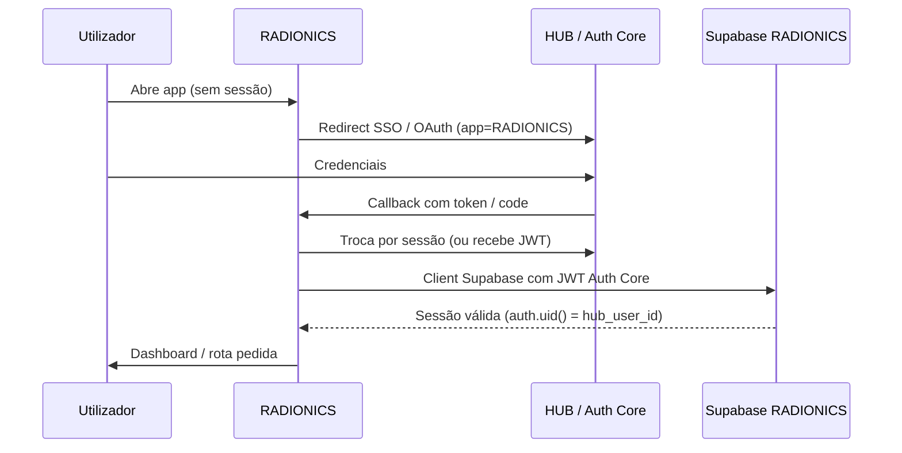
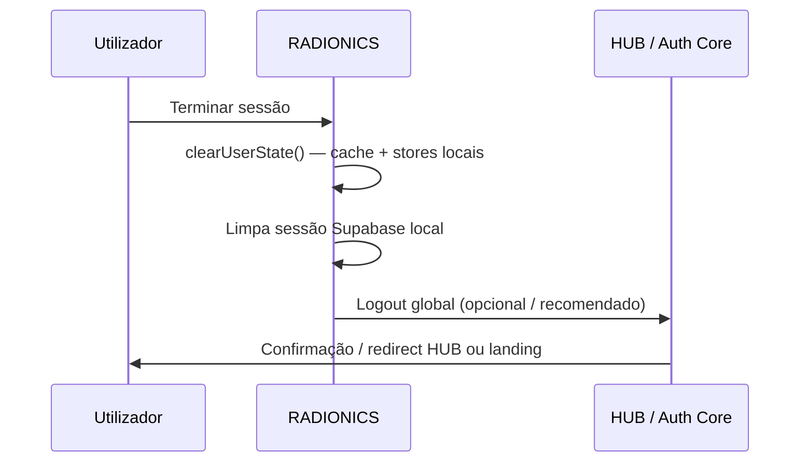

# RADIONICS — Plano de Integração HUB / Auth Core

**Date:** 2026-05-31
**Status:** Decisão arquitectural — **sem implementação nesta fase**
**Relacionado:** [`RADIONICS_AUTH_DEV_MODE.md`](./RADIONICS_AUTH_DEV_MODE.md) (auth temporário actual)

---

## 1. Contexto e decisão

O RADIONICS implementa hoje um **Auth Dev** mínimo (Supabase email/password em `/auth/login`) para testar RLS, Storage e services com `VITE_DATA_MODE=supabase`.

Na **versão final de produção**, estes fluxos **não pertencem ao RADIONICS**:

| Fluxo | Responsável final |
|-------|-------------------|
| Login | HUB / Auth Core |
| Registo | HUB / Auth Core |
| Logout | HUB / Auth Core |
| Recuperação de password | HUB / Auth Core |
| Perfil global (nome, email, avatar, contactos) | HUB / Auth Core |
| Billing / plano | HUB / Auth Core |

O RADIONICS é uma **app satélite** no ecossistema ByElamor. Autentica utilizadores via HUB; persiste **dados de domínio radiónica** no Supabase RADIONICS.

**Regra:** Não levar o Auth Dev para produção como auth principal. Não implementar registo/recovery locais em paralelo ao HUB.

---

## 2. Fluxo final — Login / Registo / Logout via HUB

### 2.1 Login (produção)



**Comportamento esperado:**

1. Utilizador acede ao RADIONICS sem sessão → redirect para `VITE_HUB_URL` (login com `return_to` / `app_code=RADIONICS`).
2. Após autenticação no HUB, callback devolve token/sessão reconhecida pelo Supabase RADIONICS.
3. RADIONICS **não** mostra formulário de login próprio em produção.
4. Rotas protegidas usam guard baseado na sessão HUB/Auth Core, não em `/auth/login` local.

### 2.2 Registo (produção)

- Exclusivamente no HUB (formulário, verificação email, termos, onboarding).
- RADIONICS **não** expõe `/auth/register`.
- Após registo, utilizador pode ser redireccionado de volta ao RADIONICS já autenticado.

### 2.3 Logout (produção)



**Comportamento esperado:**

1. Utilizador clica "Terminar sessão" no RADIONICS.
2. RADIONICS limpa **sempre** estado local (ver secção 4).
3. Logout global no HUB invalida sessão em todas as apps ByElamor.
4. Redirect para HUB ou página pública acordada — **não** para `/auth/login` dev.

### 2.4 Recuperação de password

- 100% no HUB. RADIONICS linka para `VITE_HUB_URL` (ex.: `/forgot-password`) se necessário.
- Sem páginas de recovery locais.

---

## 3. Como o RADIONICS recebe sessão e contexto

### 3.1 Identidade canónica

| Campo | Origem | Uso no RADIONICS |
|-------|--------|------------------|
| `user_id` / `auth.uid()` | Auth Core → JWT Supabase | FK `therapist_id`, RLS |
| `email` | HUB (read-only na app) | Display perfil |
| `full_name`, avatar | HUB | Display perfil |
| `radionics_role` | Claim Auth Core | `is_radionics_admin()` |
| `app_entitlements` | HUB / billing | Feature flags (futuro) |

O UUID em `auth.users` (Supabase) deve ser o **mesmo identificador** provisionado pelo Auth Core — uma identidade, múltiplas apps.

### 3.2 Mecanismos prováveis (a confirmar com Auth Core)

| Opção | Descrição |
|-------|-----------|
| **A — JWT custom** | Auth Core emite JWT; Supabase valida via JWT secret / third-party auth |
| **B — SSO + session exchange** | HUB redirect → RADIONICS troca code por sessão Supabase |
| **C — Shared session cookie** | Subdomínios `.byelamor.com` partilham cookie (menos provável cross-app) |

**Contrato mínimo para RADIONICS:**

```ts
interface RadionicsAuthContext {
  userId: string;           // auth.uid()
  email: string;
  displayName?: string;
  avatarUrl?: string;
  roles: string[];          // ex.: ['therapist', 'radionics_admin']
  isAuthenticated: boolean;
  signOut: () => Promise<void>;  // limpa local + HUB logout
}
```

Implementação futura substitui `AuthProvider` dev; interface pública (`useAuth`) pode manter-se similar para minimizar churn na UI.

### 3.3 Admin e permissões (UI vs servidor)

**Nunca confiar apenas na UI** para esconder acções admin. A aba Admin em Especialidades/Certificações usa `isCurrentUserRadionicsAdmin()` apenas para UX; `adminList*` e `adminReview*` continuam protegidos por **RLS** — utilizadores não-admin recebem erro ou listas vazias.

| Ambiente | Fonte de verdade admin |
|----------|------------------------|
| **Produção (futuro)** | HUB / Auth Core — claims (`radionics_role`, etc.) |
| **Dev Supabase** | `public.is_radionics_admin()` (RPC) — allowlist `radionics_admin_allowlist` + JWT placeholder |
| **Mock** | `adminService` retorna `true` por default para testes locais |

Implementação actual: `src/services/adminService.ts` → `isCurrentUserRadionicsAdmin()`, `getCurrentUserRadionicsRole()`.

Substituir bootstrap manual (`radionics_admin_allowlist`) por claim canónica do Auth Core:

```sql
-- is_radionics_admin() — destino final
(auth.jwt() -> 'app_metadata' ->> 'radionics_role') = 'admin'
```

Policies RLS **não mudam** — só a função de verificação.

---

## 4. Limpeza de cache local no logout

Independentemente do mecanismo de auth (dev ou HUB), o logout no RADIONICS **deve sempre**:

1. **`queryClient.clear()`** — remove cache TanStack Query (dados de utilizador anterior)
2. **Reset stores mock** (se existirem) — `resetSessionsStore`, `resetSpecialtiesStores`, `resetCertificationsStore`
3. **Anular sessão** — `session = null`, `user = null`, `isAuthenticated = false`
4. **Redirect** — dev: `/auth/login`; produção: HUB ou landing pública

Queries sensíveis a invalidar explicitamente (referência):

- `['sessions']`, `['session', id]`
- `['specialties']`, `['approved-specialties']`
- `['my-certifications']`, `['all-certifications']`
- `['my-specialty-requests']`, `['all-specialty-requests']`
- `['profile']` (futuro)

Função central actual: `src/lib/auth/clearUserState.ts` — **reutilizar** na integração HUB; apenas o passo de invalidação de token muda (HUB logout em vez de `supabase.auth.signOut` dev).

**Risco se não limpar:** utilizador B vê dados em cache do utilizador A na mesma máquina/browser.

---

## 5. Divisão de dados — HUB vs RADIONICS

### 5.1 Fica no HUB / Auth Core

| Dado | Notas |
|------|-------|
| Credenciais (password hash) | Nunca no RADIONICS |
| Email, verificação email | Identidade global |
| Nome, avatar, bio global | Perfil ecossistema |
| Telefone, morada (global) | Partilhado entre apps |
| Plano / billing / subscrição | ByElamor central |
| Preferências globais | Idioma, notificações cross-app |
| Audit log de auth | Login/logout central |
| Roles globais | `admin`, `therapist`, etc. |

### 5.1.1 Dados admin de visualização (requester)

`requesterName` / `requesterEmail` nos cartões Admin **não são guardados** em tabelas RADIONICS.

| Fase | Origem |
|------|--------|
| Dev Supabase | RPC `radionics_admin_requester_profiles` (leitura `auth.users`, admin only) |
| Produção | HUB / Auth Core — nome e email canónicos do terapeuta |

### 5.2 Fica no RADIONICS (Supabase)

| Dado | Tabelas / storage |
|------|-------------------|
| Especialidades (catálogo) | `radionics_specialties` |
| Pedidos de especialidade | `radionics_specialty_requests` |
| Certificações terapeuta | `therapist_specialty_certifications` |
| Documentos certificação | `therapist_specialty_documents` + bucket `radionics-certifications` |
| Sessões radiónicas | `sessions` + extensões RADIONICS (futuro) |
| Clientes (contexto terapeuta) | Tabelas RADIONICS |
| Templates, relatórios | Tabelas RADIONICS |
| Estado de workspace | App state / snapshots |

**Regra:** RADIONICS guarda `therapist_id` (= `auth.uid()`) como FK. Não duplica perfil global — **lê do HUB** ou de claims JWT para display.

### 5.3 Perfil no RADIONICS (`/profile`)

| Actual (dev) | Final (HUB) |
|--------------|-------------|
| Formulário local editável (mock) | Read-only + link "Editar no HUB" (`VITE_HUB_URL/profile`) |
| Logout local Supabase | Logout via HUB |
| Email do Supabase user | Email do contexto HUB |

---

## 6. Riscos de misturar Supabase Auth directo com HUB Auth

| Risco | Descrição | Mitigação |
|-------|-----------|-----------|
| **Duas identidades** | User regista no Supabase dev e no HUB → UUIDs diferentes, RLS quebrado | Dev users separados; produção só HUB; nunca dual-register |
| **Dois logins** | `/auth/login` local + login HUB confundem utilizadores | Remover login local em produção; feature flag |
| **Sessões órfãs** | Logout HUB não limpa token Supabase local (ou vice-versa) | Logout unificado: HUB + clear local sempre |
| **Admin inconsistente** | `allowlist` manual vs claim HUB | Migrar para claim única; deprecar allowlist |
| **Cache cross-user** | Query cache após troca de conta | `clearUserState()` obrigatório em todo logout |
| **JWT incompatível** | Supabase RLS espera `auth.uid()` X, HUB emite Y | Contrato Auth Core ↔ Supabase antes de go-live |
| **Dívida técnica** | Features built on dev AuthProvider | Marcar código dev como descartável; não expandir |
| **Compliance** | Passwords geridas na app errada | Zero password UI no RADIONICS em produção |

**Regra de ouro:** Em produção, **uma única fonte de identidade** (HUB/Auth Core). Supabase Auth directo fica restrito a **dev/staging** com `VITE_DATA_MODE=supabase` e utilizadores de teste.

---

## 7. Roadmap de migração (alto nível)

| Fase | Acção |
|------|-------|
| **Actual** | Auth Dev Supabase — testar RLS/services |
| **M1** | Contrato Auth Core ↔ Supabase JWT (`auth.uid()`) |
| **M2** | Substituir `AuthProvider` dev por adapter HUB |
| **M3** | Remover `/auth/login`; redirect para HUB |
| **M4** | Perfil read-only + link HUB; logout global |
| **M5** | Deprecar `radionics_admin_allowlist`; claims HUB |
| **M6** | Remover código dev (`src/pages/auth/`, flags dev) |

---

## 8. Variáveis de ambiente (referência)

```env
VITE_APP_CODE=RADIONICS
VITE_HUB_URL=https://hub.byelamor.com    # login, registo, logout, perfil global
VITE_DATA_MODE=mock|supabase             # supabase + auth dev = só dev/staging
```

Em produção: `VITE_HUB_URL` é obrigatório; auth dev desactivado.

---

## 9. Ficheiros afectados na migração (futuro)

```
src/lib/auth/AuthProvider.tsx      → adapter HUB
src/lib/auth/RequireSupabaseAuth.tsx → RequireHubAuth (ou rename genérico)
src/lib/auth/clearUserState.ts     → manter
src/pages/auth/LoginPage.tsx       → remover em produção
docs/RADIONICS_AUTH_DEV_MODE.md    → arquivar como histórico dev
```

---

## 10. Referências

- [`RADIONICS_AUTH_DEV_MODE.md`](./RADIONICS_AUTH_DEV_MODE.md) — auth temporário actual
- [`RADIONICS_SUPABASE_SCHEMA_PHASE1.md`](./RADIONICS_SUPABASE_SCHEMA_PHASE1.md) — `is_radionics_admin()` placeholder
- [`RADIONICS_SUPABASE_PHASE2A_SERVICES.md`](./RADIONICS_SUPABASE_PHASE2A_SERVICES.md) — RLS depende de `auth.uid()`
- `.env.example` — `VITE_HUB_URL`, `VITE_APP_CODE`
